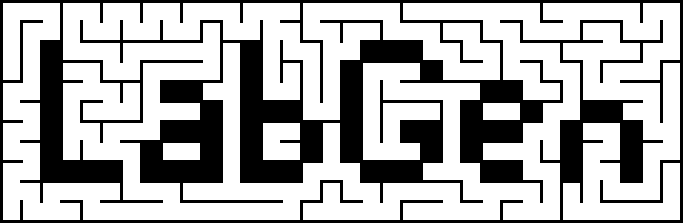

# Labgen

> `cargo run -- 34 11 --text (2,2,LabGen) --passagewidth 17 --wallwidth 3 -ologo`

## Examples

> 
> `cargo run -- 15 15 -a -fgif --tempcells -obacktrack`

## Feature descriptions
- Wrapping
  - allows maze generation to jump from opposite sides of maze
- Exclusions
  - areas of the maze that will not be filled and are thus inaccessible
- Rooms
  - connected areas of the maze that by default will not disrupt the perfect aspect of the maze
  - if doors are placed manually then this is no longer guaranteed
- Batching
  - increases the number of cells drawn per frame to reduce the total animation time
- Regions
  - areas of the maze that are filled with connected maze
  - (WIP) can be overridden to form disconnected but adjacent parts of the maze without the use of exclusions

## Feature Compatability

|  Maze Type | Wrapping | Exclusions | Rooms |
|------------|----------|------------|-------|
| backtrack    | ✅ | ✅ | ✅ |
| prim         | ✅ | ✅ | ✅ |
| binary-tree  | ❌ | ✅ | ✅ |
| sidewinder   | horizontal only | ❌ | ❌ |
| noise        | ❌ | ❌ | ❌ |
| growing-tree | ✅ | ✅ | ✅ |
| wilsons      | ✅ | ✅ | ✅ |
| kruskal      | ✅ | ✅ | ✅ |

|  Image Type | Animation | Batching | Wrapping | Exclusions | Rooms | Temporary Cells |
|-------------|-----------|----------|----------|------------|-------|---------|
| png            | ❌ | ❌ | ✅ | ✅ | ✅ | ❌ |
| text           | ❌ | ❌ | ✅ | ✅ | ✅ | ❌ |
| svg            | ❌ | ❌ | ❌ | ✅ | ✅ | ❌ |
| gif            | ✅ | ✅ | ✅ | ✅ | ✅ | ✅ |
| gif-compressed | ✅ | ❌ | ✅ | ✅ | ✅ | ❌ |

### Known Issues

- binary tree mazes with rooms or exclusions will develop isolated regions
- animations generated with wrapping will only render one side of the passage when wrapping around the edge
- temp cells do not work with wrapping
